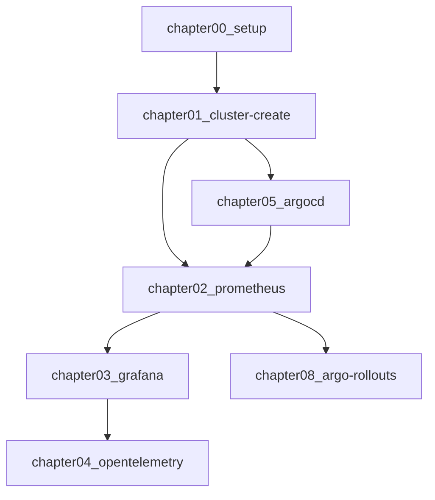

# Overview
[CloudNative Days Tokyo 2023 実行委員会のドキュメント](https://github.com/cloudnativedaysjp/cndt2023-handson)を学習のために一部修正したものです。
WSL2環境, Mac環境,での学習を想定しています。

このハンズオンでは、Prometheus・Grafana・OpenTelemetry・Argo CD・Argo Rollouts といったよく利用されるクラウドネイティブな OSS について触れることができるハンズオンです。

## Chapter
準備用chapter1＋全6chapterから構成されています。
- [chapter00_setup](./chapter00_setup/)
- [chapter01_cluster-create](./chapter01_cluster-create/)
- [chapter02_prometheus](./chapter02_prometheus/)
- [chapter03_grafana](./chapter03_grafana/)
- [chapter04_opentelemetry](./chapter04_opentelemetry/)
- [chapter05_argocd](./chapter05_argocd/)
- [chapter08_argo-rollouts](./chapter08_argo-rollouts/)

### 進め方
まずは、chapter00, chapter01を実施してhandsonを進めるための環境を構築してください。 
その後は、順番にchapterを進めることはもちろん、下記フローチャートのように、気になる技術に焦点を当てたchapterを進めることもできます。

